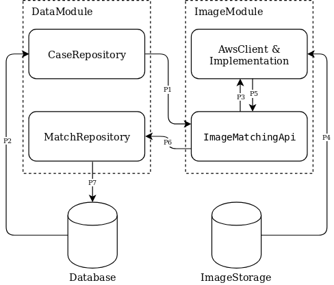

# Image processing module

## New BroCode repo gradle migration

* Use Spring to manage all services and properties, see ctx class `FindingImageApplication`
[link](./src/main/java/com/epam/hackathon/image/FindingImageApplication.java)

* Use `CaseRepository` to fetch cases which contain image path/url.

* Convert/Map aws `CompareFacesMatch` to domain object.

## Process flow:

1. Image service queries for tasks, which is Lost/Finding case pair.
2. Data service fetches a pair along with corresponding image path/url to Image service.
3. Image service passes required info to Aws client service.
4. Aws client service fetch image binary data from image-storage according path provided by data service.
5. Aws client return match result.
6. Image service does necessary mapping/filtering, then passes result to Data service.
7. Data service saves result to metadata database.